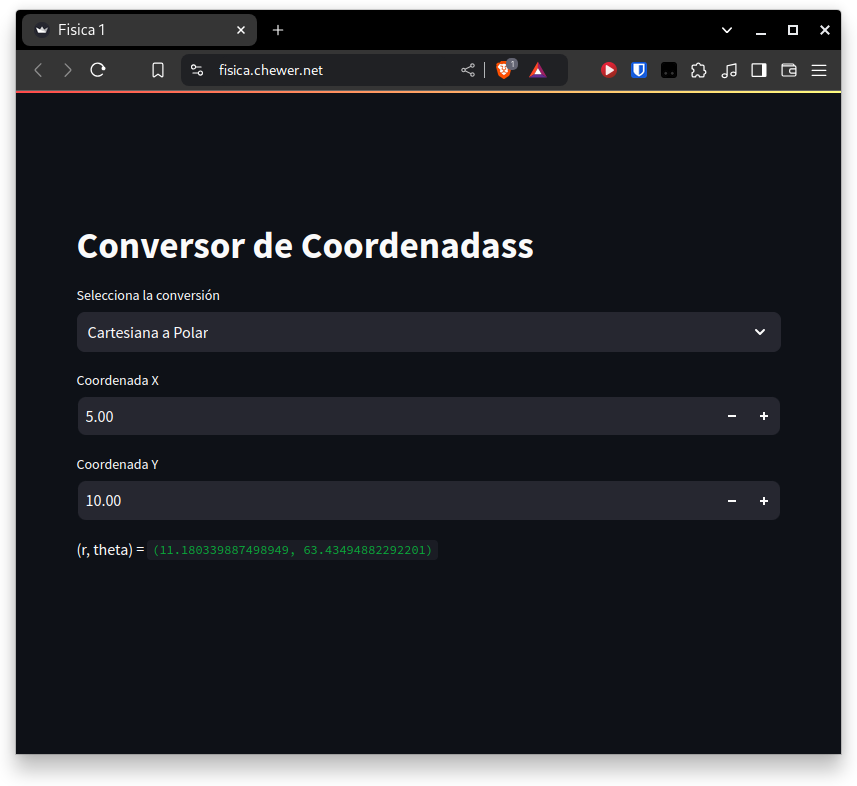

# Coordinate Converter

This is a simple coordinate conversion application built using Python and Streamlit. It allows users to convert from Cartesian to Polar coordinate systems and the other way round.


## Features

- Convert Polar coordinates (r, θ) to Cartesian coordinates (x, y)
- Convert Cartesian coordinates (x, y) to Polar coordinates (r, θ)
- Intuitive Streamlit-based user interface

## Deployment

The application was deployed on a Raspberry Pi 4 and can be accessed at https://fisica.chewer.net/.


## Usage

1. Clone the repository:
```
git clone https://github.com/your-username/coordinate-converter.git
```

2. Change to the project directory:
```
cd coordinate-converter
```

3. Install the required dependencies:
```
pip install -r requirements.txt
```

5. Run the Streamlit application:
```
streamlit run web.py
```

The application will start running on `http://localhost:8501`.

5. Use the dropdown menu to select the desired conversion, input the values, and the result will be displayed.

## Docker

The project also includes a `Dockerfile` and a `docker-compose.yml` file, allowing you to run the application in a Docker container.

To build and run the Docker container:
```
docker compose up
```

The application will be available at `http://localhost:8520`.

## Project Structure

- `conversor.py`: Contains the functions for converting between Cartesian and Polar coordinates.
- `web.py`: Provides the user interface for the coordinate converter.
- `Dockerfile`: Defines the Docker image for the application.
- `docker-compose.yml`: Configures the Docker Compose setup for the application.
- `deploy.sh`: Pulls the latest changes from the Git repository and rebuilding the Docker container.
- `requirements.txt`: Lists the Python dependencies required for the application.


## Screenshots

